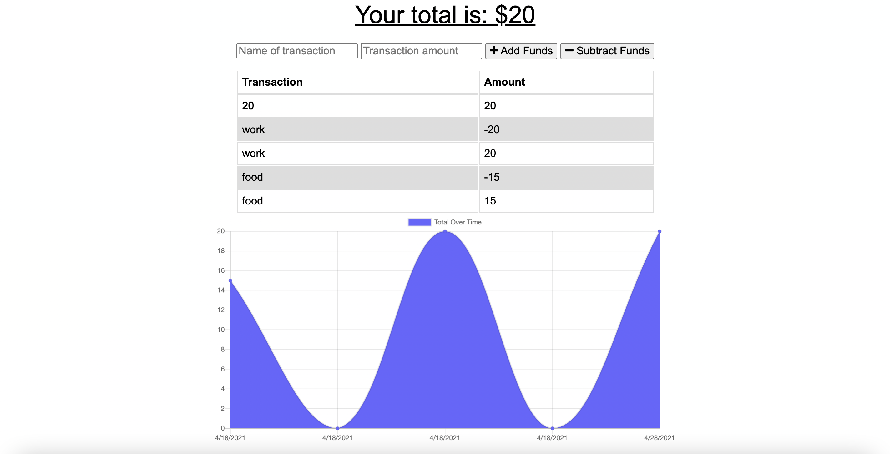
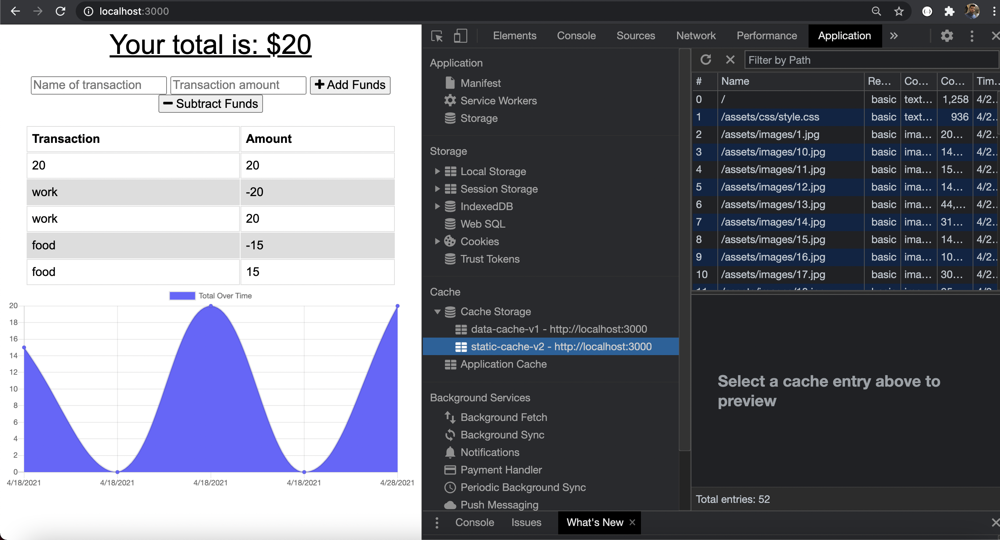

# budgetTrackers

License for this app is : MIT

# Table of Contents

- [Description](#description)
- [License](#license)
- [Questions](#questions)
- [Heroku-Link](#heroku-link)
- [Demo](#demo)

## Description:
    This project is a Budget tracker web app that allows the user to track their expenses, the main perpus of this app is the web performance section and abality to have it run offline 

## License:
    For information about the license, click the link below.

- [License](https://opensource.org/license/random)

## Questions:
    Contact me at the following Link:

- [GitHub Profile](https://github.com/omartdh)

    Send me an email at: omartdh@gmail.com

## Heroku-Link:

- [heroku link](https://polar-hamlet-91704.herokuapp.com/)

## Demo:

